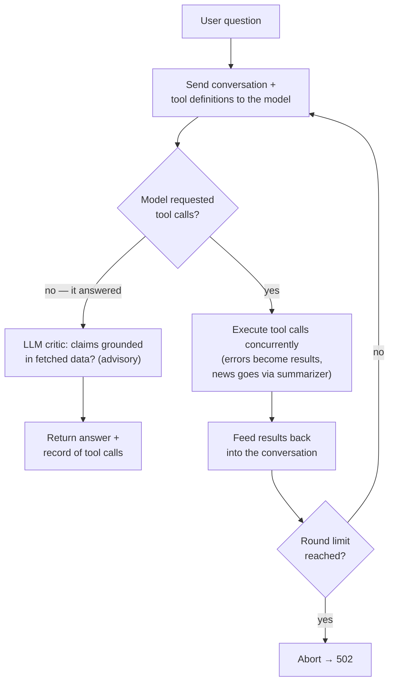

# Stock Insights Assistant

A small FastAPI web app that answers natural-language questions about stocks.
An OpenAI-powered agent decides what live market data it needs from Finnhub
(quotes, profiles, peers, news, financials), fetches it, and replies with a
concise, data-grounded answer. For research only — it never gives buy/sell
advice.


## Quick start

### 1. Clone and configure

```bash
cp .env.example .env
# Fill in FINNHUB_API_KEY (free at finnhub.io) and OPENAI_API_KEY
```

If keys are missing the API responds with a clear 503 explaining what to set.

### 2. Run with Docker Compose

```bash
docker compose up --build
```

The API is available at `http://localhost:8000`.

### Or run locally without Docker

```bash
python3 -m venv .venv && source .venv/bin/activate
pip install -r requirements-dev.txt
uvicorn app.main:app --reload
```


## Web UI

Open **http://localhost:8000** in a browser. The app is a simple
ChatGPT-style chat: your questions appear as right-aligned bubbles, the
assistant answers on the left, and a sidebar offers suggested stock
questions to get started (it collapses behind a toggle on small screens).
Each answer has a collapsible "Details" section with the detected ticker
symbols and the exact JSON returned by the API, I thought this would be
useful for debugging.

Conversations are remembered for the session, so follow-ups like "what
about its P/E?" work. "New chat" starts a fresh conversation; history
lives in memory only and resets when the server restarts.

I did not want to over complicate the front end so it is plain HTML/CSS/vanilla JS served by FastAPI itself from `app/static/` — no build step, no frontend dependencies.

Some questions to try:

- "How is AAPL doing today?"
- "Compare TSLA and F"
- "Tell me about Apple"
- "Why is Tesla stock moving this week?"
- "Is NVDA expensive right now?"
- "Compare AAPL to its competitors"

## Endpoints

| Method | Path      | Description                        |
|--------|-----------|------------------------------------|
| GET    | `/`       | Web UI                             |
| GET    | `/health` | Liveness check                     |
| POST   | `/ask`    | Submit a natural-language question |

`/ask` error responses: **422** for invalid input (empty query), **502** when
an upstream service fails, **503** with instructions when API keys are not
configured — internal error details are logged, never returned to the client.
An unknown ticker is not an error: the agent explains the problem in a
normal 200 answer.

### Example request

```bash
curl -X POST http://localhost:8000/ask \
  -H "Content-Type: application/json" \
  -d '{"query": "How is AAPL doing today?"}'
```

### Example response

```json
{
  "query": "How is AAPL doing today?",
  "intent": "single_stock",
  "tickers": ["AAPL"],
  "answer": "Apple (AAPL) is currently trading at $189.50, up 1.34% from yesterday's close of $187.00. Today's range has been $186.50 – $191.20.",
  "tool_calls": [
    {"tool": "get_quote", "ticker": "AAPL", "ok": true}
  ],
  "conversation_id": "1666e02443d1"
}
```

Send `conversation_id` back on the next request to ask follow-up questions
("What about its P/E?"); omit it to start a new conversation.

## Architecture

```
User
 └─ POST /ask
     └─ Orchestrator (agents/orchestrator.py) — request lifecycle, error mapping
         └─ InsightsAgent (agents/insights_agent.py) — OpenAI tool-calling loop
             ├─ get_quote            ┐
             ├─ get_company_profile  │
             ├─ get_peers            ├─ MarketData (services/market_data.py)
             ├─ get_basic_financials │
             └─ get_company_news ────┘──→ NewsSummarizer (agents/news_summarizer.py)
```

This is a genuine agentic loop: the model receives tool definitions, decides
which tools to call and with what arguments, results are fed back, and it
keeps going until it has enough data to answer (bounded by `MAX_TOOL_ROUNDS`).
Tool calls within a round run concurrently. Tool errors, unknown tickers and
transient provider timeouts are returned to the model as results so it
can answer from whatever data it did get, instead of the API erroring out.

### The agent loop



Two supporting components:

- **NewsSummarizer subagent** — company news is noisy (8 articles of headlines
  and blurbs). A cheap LLM call condenses them to 2-3 sentences before they
  enter the main agent's context, controlling token bloat. If summarization
  fails it degrades to raw headlines rather than failing the tool.
- **LLM answer critic** (`agents/critic.py`) — after the final answer, a
  second model call checks every claim against the data the tools returned:
  wrong numbers, tickers that were never fetched, unsupported causal claims.
  Ungrounded answers are logged as warnings. Advisory and fail-open — a
  critic outage never blocks an answer, and it is skipped when no tools ran.

**Key design choices:**

- **`MarketDataProvider` protocol** — `FinnhubProvider` and `MockProvider` both satisfy
  the same async interface; swapping data sources requires zero changes outside
  `market_data.py`.
- **Dependency injection via FastAPI `Depends`** — `main.py` injects the provider and
  agent; tests override them trivially.
- **Intent derived from behavior** — instead of classifying the query up front,
  the orchestrator labels the request from the tools the agent actually used
  (two quotes → comparison, a profile → lookup, none → unknown).
- **Thin orchestrator** — runs the agent and translates failures into
  `UpstreamError`/`OrchestratorError`, keeping `main.py` clean.

---
## Logging

Every request gets a short correlation ID, included in each log line and
returned to the client as the `X-Request-ID` header. To trace a failed
request, take the ID from the response header and grep the logs:

```
2026-06-11 18:27:48 INFO    [055ba12c] app.agents.orchestrator: query received: "Compare TSLA and F"
2026-06-11 18:27:48 INFO    [055ba12c] app.agents.insights_agent: round 1: model requested 2 tool call(s), tokens=312 in 850ms
2026-06-11 18:27:48 INFO    [055ba12c] app.services.market_data: finnhub quote TSLA $245.10 (+1.28%) in 142ms
2026-06-11 18:27:48 INFO    [055ba12c] app.services.market_data: finnhub quote F $12.30 (+1.65%) in 98ms
2026-06-11 18:27:49 INFO    [055ba12c] app.agents.insights_agent: agent answered after 2 round(s), tokens=521 in 920ms
2026-06-11 18:27:50 INFO    [055ba12c] app.agents.critic: critic: answer grounded in tool data
2026-06-11 18:27:50 INFO    [055ba12c] app.agents.orchestrator: intent=stock_comparison tickers=['TSLA', 'F'] after 2 tool call(s), 187 char answer
```

Conventions:
- **INFO** — pipeline milestones (each agent round, each external call with latency, outcome)
- **WARNING** — handled problems (unknown ticker, malformed tool arguments)
- **ERROR** — unexpected failures, logged once with traceback at the point of most context

Set verbosity with the `LOG_LEVEL` environment variable (default `INFO`).

## Running tests

```bash
pytest --tb=short -q
```

Tests never call real APIs. The agent tests drive the tool-calling loop with a
mocked OpenAI client; market data tests run the real `FinnhubProvider` parsing
logic against stubbed HTTP responses via `httpx.MockTransport`.

## Linting

```bash
ruff check app/ tests/
```

---

## Trade-offs

| Decision | Rationale |
|----------|-----------|
| LLM tool-calling over regex routing | The model resolves any company name and decides what data it needs. Costs ~3-4 LLM calls per query instead of 1; bounded by `MAX_TOOL_ROUNDS`. |
| Tool errors fed back to the model | An unknown ticker or one timed-out fetch becomes part of the answer instead of failing the request. OpenAI outages still return 502. |
| LLM critic over a deterministic verifier | A second model call checks the whole answer semantically — misattributed tickers and unsupported claims, not just dollar figures a regex could match. Costs one extra call per answer; advisory and fail-open, so a critic outage never blocks a response. |
| In-memory conversation store | Follow-ups ("what about its P/E?") need referents, not persistence. A capped dict does it in ~50 lines; history resets on restart by design. Only the conversation text is replayed — old tool data is never reused, so prices stay fresh. |
| No caching | Adds complexity; a Redis layer is a straightforward future addition. |
| No auth | Out of scope for a take-home prototype. Add an API-key header or OAuth when needed. |
| `gpt-4o-mini` default | Good balance of cost and quality for short summaries and reliable tool selection. |

---

## Future improvements

- **Caching** — Redis or an in-process TTL cache to avoid redundant Finnhub calls.
- **Rate limiting** — per-IP throttling with `slowapi`.
- **More tools** — historical price charts, earnings calendar, insider transactions.
- **Streaming responses** — `text/event-stream` for perceived latency improvement.
- **Auth** — API-key middleware for production use.
- **Observability** — structured logging + OpenTelemetry traces.
- **Ticker disambiguation** — handle ambiguous names ("Apple" vs "Apple Hospitality").

---

## AI tools used

**In the app:**

- **OpenAI `gpt-4o-mini`** powers the agent loop (tool selection + final
  answers), the news summarizer subagent, and the answer critic. Prompts pin
  the model to fetched data, forbid buy/sell recommendations, and require
  plain text.

**Building the app:**

- **opencode (Claude)** was used as an AI pair-programmer throughout:
  scaffolding the initial structure, writing tests, and running structured
  review passes against the assignment criteria. All design decisions
  (agent loop vs. pipeline, error taxonomy, what to keep out of scope) were
  made deliberately and reviewed by hand — every line is explainable.
- Live end-to-end testing against the real APIs caught several bugs that
  AI-generated unit tests alone missed (a settings crash, markdown leaking
  into the UI, sequential tool execution timing out) — worth knowing if you
  evaluate AI-assisted projects.
